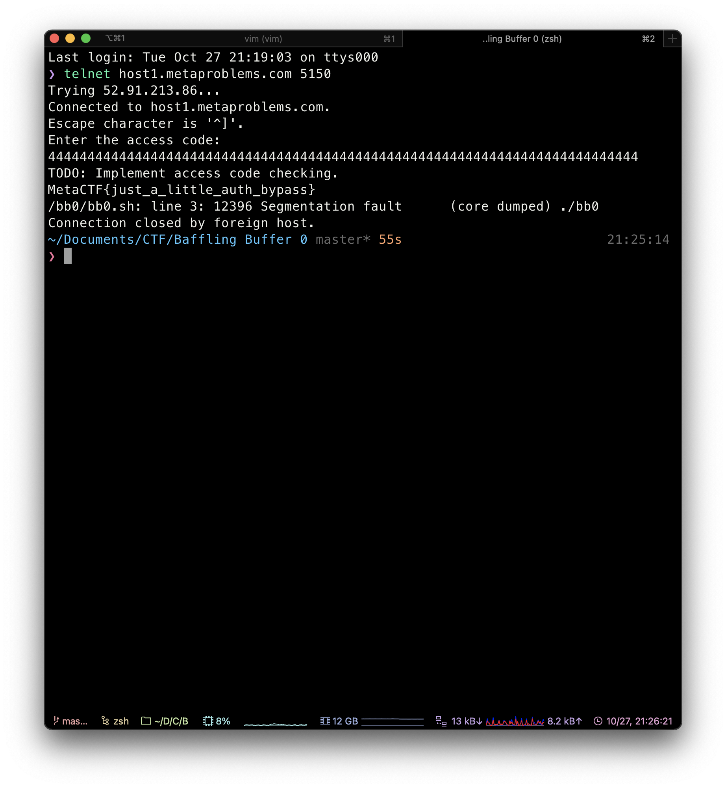

While hunting for vulnerabilities in client infrastructure, you discover a strange service located at host1.metaproblems.com 5150. You've uncovered the binary and source code code of the remote service, which looks somewhat unfinished. The code is written in a very exploitable manner. Can you find out how to make the program give you the flag?

First, telnet to the server. The server prompts "enter access code". The code is shown as following. Since the input buffer can only contain 48 chars. We suspect that buffer overflow will grant us the flag. So by inputing a string with length bigger than 48, I got the flag. However, the porblem seems not to care about the overflow. The final flag is `just_a_little_auth_bypass` so it should be a authentication problem. 

```c
#include <stdio.h>
#include <stdlib.h>

void vuln() {
	int isAuthenticated = 0;
	char buf[48];
	puts("Enter the access code: ");
	gets(buf);
	puts("TODO: Implement access code checking.");
	if(isAuthenticated) {
		system("/bin/cat flag.txt");
	}
	else {
		puts("Invalid auth!");
	}
}

int main() {
	setbuf(stdout, 0);
	setbuf(stdin, 0);
	setbuf(stderr, 0);
	vuln();
	return 0;
}
```


