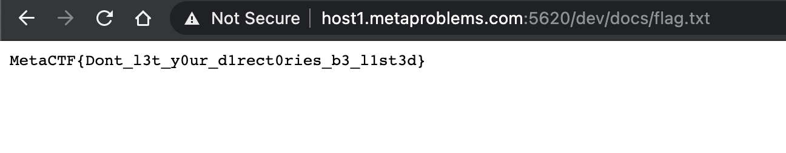

I've made this cool new web application that I plan to use to host a blog. Please check it out at http://host1.metaproblems.com:5620/ Right now it's still currently being built, but I hope you enjoy what's there so far!

The problem is straightforward. Notice that in the browser address bar, the home page is located in some folder and I suspected that the folder are accessable. So I removed the string before the `dev` and immediately I can see the secret docs. And the flag resides inside the doc folder. 

