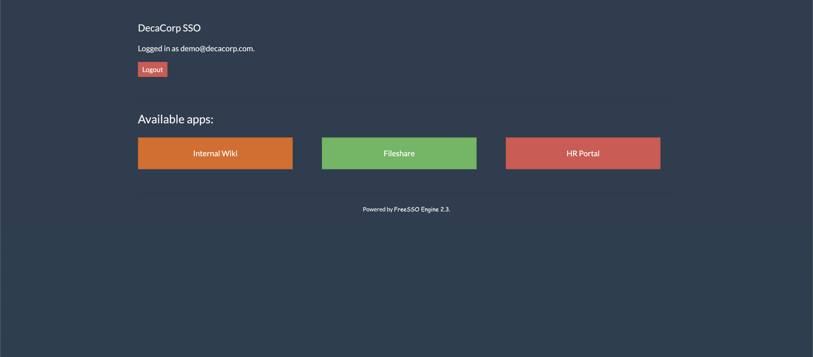

You stumbled across [this whitepaper](http://host1.metaproblems.com:4550/share?id=rnBqbAeL4NhphwF) about security of the Internet of Things while doing some research on the topic. You never heard about the company before, but the paper looked pretty trustworthy. The real credibility test though is how secure their own site is. Can you check it out?

The title of this question is careless redirections. So there should be some problem with the redirections. 

I started with the given link. The redirecting process showed me some hints. The given link is redirected multiple times and some redirections shows us usesr name, password and access token. However, after clicking on the "Your Files". The website said I was not the admin and have no access to the files. The redirections to the "Your files" is pretty much the same as the previous link. But the page did give me some usefule information: the email of the admin, which is useful in the later stage. 

So I tried to find other entry points. Surprisingly, "Logout" button took me took a control-panel-like page (don't do this when you design UI, please). 

The internal Wiki just rejects me. But it looks like there should be some extra information. I went on with the HR Portal and something interesting happened. 

Before beeing redirecting to another page, there is a login page that takes in a username and a key. However, the key is empty. So I thought I could use this. By changeing the username to the admin email, we have `http://host1.metaproblems.com:4553/login.php?username=admin@decacorp.com&key=`. Hit enter and here is the flag. 

