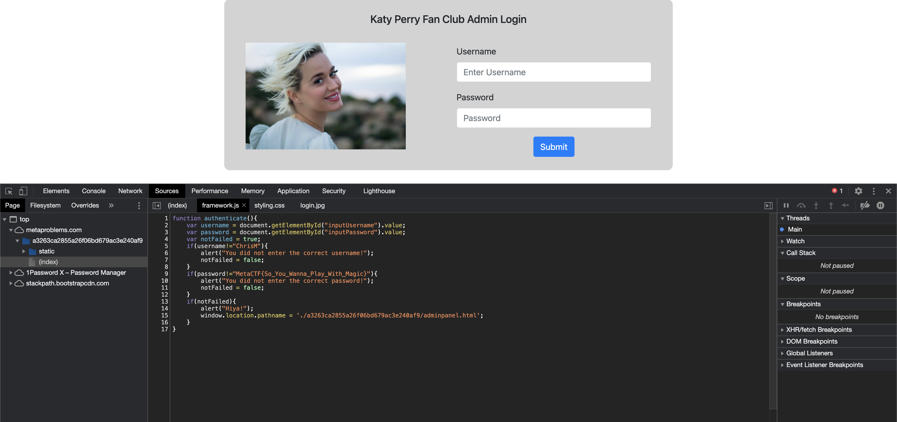

Uh oh, I woke up to hear that some Swifties seem to have sabotaged my Katy Perry fan page! After writing about why KP is clearly the better artist, I believe they hacked into the system and somehow changed my password!

I need to publish a big story today before TMZ steals my scoop, however I can't find my way back into the admin panel. Can you please help me out by finding my password so I can get back to work?

*Note:* obviously most sites aren't built like this, but it's good to get familiar with examining how a website's source code looks, how resources get loaded in, etc :)

[Click here to visit the site](https://metaproblems.com/a3263ca2855a26f06bd679ac3e240af9/)

I didn't submit this one but it's very easy. Open the source code, and immediately the hard coded password is shown. 

