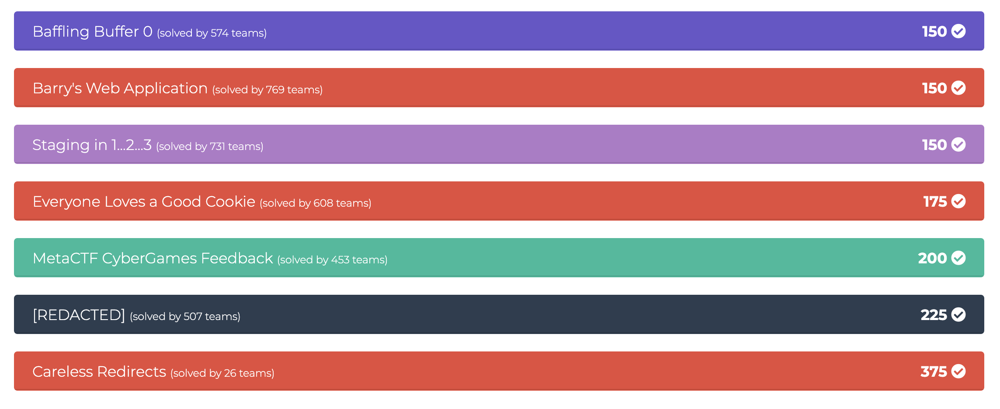

I missed the contest cause I got one midterm to do and one more to prepare. I was surprised that the problems are still accessible and tried some of them. The web exploitation is fun. I feel like I am very close to the "Joy With Tokens". But anyway, it's a fun contest. 

