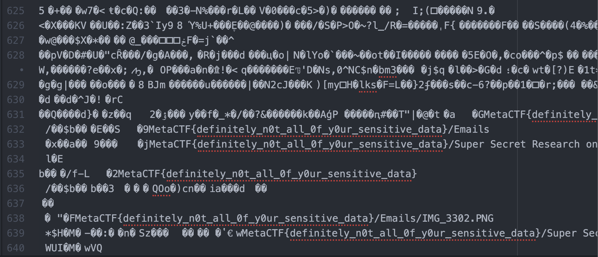

The Incident Response (IR) team identified evidence that a Threat Actor accessed a system that contains sensitive company information. The Chief Information Security Officer (CISO) wants to know if any data was accessed or taken.

There was a suspicious file created during the timeframe of Threat Actor activity: C:\123.tmp. Can you check it out?

I had no idea how to solve this. But after skimming through the file in a text editor, I found the flag is shown as plain text in the end of the file. The key is `definitely_n0t_all_0f_y0ur_sensitive_data`. Kinda funny. 

