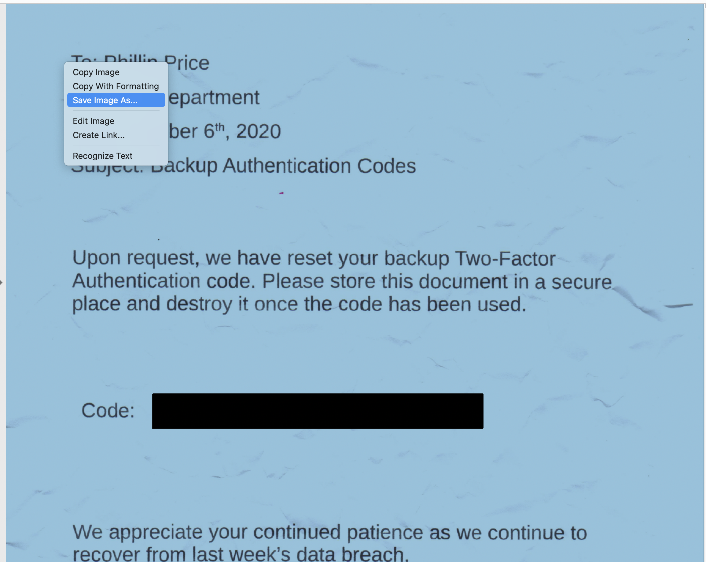
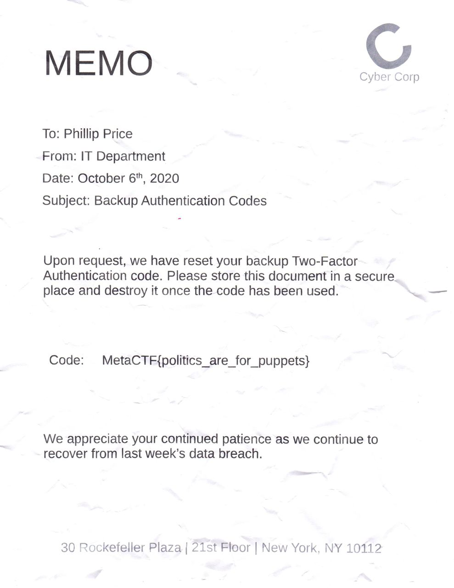

The CEO of Cyber Corp has strangely disappeared over the weekend. After looking more into his disappearance Local Police Department thinks he might have gotten caught up into some illicit activities.

The IT Department just conducted a search through his company-provided laptop and found an old [memo](https://metaproblems.com/64caa79bcb6c606269db91db9d57f46e/cybercorp_memo.pdf) containing a One Time Password to log into his e-mail. However it seems as if someone has redacted the code, can you recover it for us?

The question is a bit straightforward cause I played with the pdf redact function in my pdf viewer before. Open the pdf in the viewer and select the background image. Saving the background image does not save the black box. So we can see the flag. 

